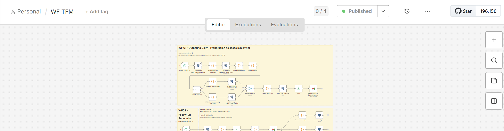

# Agente de Cobros — Trabajador virtual para gestión de facturas pendientes

Recreación con datos sintéticos de mi Trabajo Final de Máster (Automation & AI,
Nuclio Digital School). El PoC original usaba Snowflake + Google Sheets; esta
versión sustituye ambos por **PostgreSQL**, manteniendo la misma arquitectura y
lógica de negocio, y añade **Claude (Anthropic)** como motor de clasificación de
respuestas en lugar de OpenAI.

> Los datos son 100% sintéticos, generados con [Faker](https://faker.readthedocs.io/).
> No contienen información real de clientes ni de la empresa del caso de negocio
> original.

## Contexto del caso de negocio

En compañías industriales de venta al por mayor con gran volumen de clientes,
buena parte de las facturas vencidas no se deben a falta de voluntad de pago,
sino a fricción operativa: los equipos de Créditos/Accounts Receivable tienen
recursos limitados y no llegan a dar seguimiento a todos los casos, especialmente
a los clientes de menor volumen ("long tail").

Este proyecto automatiza el **primer contacto y seguimiento de facturas
pendientes de cobro**, cubriendo ese segmento hoy desatendido, sin ampliar
equipo.

## Arquitectura

```
warehouse.customer_ledger_view   →  simula la fuente de verdad (Snowflake en el
                                     PoC original), datos de facturas generados
                                     con Faker

credit_ops.*                     →  tablas operativas (antes en Google Sheets):
                                     credit_cases, email_threads,
                                     thread_case_map, agent_action_log,
                                     closed_threads
```

**WF01 — Outbound Daily (preparación de casos):** consulta el warehouse cada
mañana, calcula aging buckets y prepara los casos nuevos para el primer
contacto, sin enviar nada todavía.

**WF02 — Follow-up Scheduler:** dentro de una ventana horaria controlada, envía
el primer contacto a los casos nuevos y gestiona los recordatorios automáticos
(cada 2 días, máximo 5 intentos) para los que no responden.

**WF03 — Inbound listener:** escucha las respuestas entrantes, correlaciona
cada una con su caso, la clasifica con Claude (confirmación de pago, promesa de
pago, disputa, solicitud de información...) y detiene los recordatorios en
cuanto hay respuesta.

Todas las acciones quedan registradas en `agent_action_log` para trazabilidad y
control de reprocesos.



## Stack técnico

- **n8n** — orquestación del flujo
- **PostgreSQL** — warehouse (fuente de datos) + capa operativa
- **Claude (Anthropic)** vía Basic LLM Chain + Structured Output Parser con
  `autoFix` — clasificación de respuestas con salida JSON validada
- **Faker (Python)** — generación de datos sintéticos de facturas
- **Gmail API** — envío y recepción de correos (demo)

## Contenido del repositorio

```
schema.sql                       — DDL completo (warehouse + credit_ops)
migration_control_columns.sql    — columnas de control descubiertas al auditar
                                    el flujo real (ver sección de debugging)
generate_warehouse_data.py       — generador de facturas sintéticas con Faker
WF_TFM_agente_de_cobros.json     — export completo del workflow de n8n
01_workflows_overview.png        — diagrama general de los tres workflows
02_wf03_inbound_listener.png     — detalle del flujo de escucha y clasificación
03_wf01_detalle.png              — detalle del flujo de preparación de casos
```

## Cómo reproducirlo

```bash
psql -U tu_usuario -d tu_base -f schema.sql
psql -U tu_usuario -d tu_base -f migration_control_columns.sql

pip install faker psycopg2-binary --break-system-packages
export PGHOST=localhost PGPORT=5432 PGDATABASE=tu_base \
       PGUSER=tu_usuario PGPASSWORD=xxxx
python3 generate_warehouse_data.py --clientes 80 --facturas-por-cliente 4
```

Después, importa `WF_TFM_agente_de_cobros.json` en tu instancia de n8n y
configura las credenciales de Postgres, Gmail y Anthropic.

## Proceso de debugging — lecciones de la migración

Migrar de Sheets/Snowflake a Postgres, y de OpenAI a Claude, sacó a la luz varios
bugs que en el entorno original pasaban desapercibidos. Documentarlos aquí
porque el proceso de encontrarlos es tan parte del proyecto como el resultado
final:

1. **Iteración incompleta en un Code node.** Un nodo que construía filas para
   `thread_case_map` usaba `.item` (sin índice) en modo "Run Once for All
   Items" — en ese modo, ese accesor solo resuelve al primer item del lote. El
   resultado: de 10 hilos generados por ejecución, solo 1 llegaba a escribirse
   en la tabla puente. Los nodos hermanos ya iteraban correctamente con
   `$input.all()`; bastó con alinear los tres al mismo patrón.

2. **Regex de extracción de ID con caracteres especiales.** El identificador de
   hilo (`thread_id`) se extrae del asunto del email con una expresión regular.
   Como los nombres de cliente (generados con Faker) a veces contienen `&`,
   puntos o tildes, el patrón original se cortaba en el primer carácter no
   contemplado, perdiendo el resto del identificador (incluido el timestamp).
   Se amplió la clase de caracteres para capturar el ID completo.

3. **Pérdida de campos al pasar por un nodo de LLM (chain).** Un "Basic LLM
   Chain" reemplaza el `$json` de entrada por su propia respuesta — no arrastra
   los campos originales del item. Esto hacía que `thread_id` (que sí existía
   antes del nodo) llegara `undefined` al Postgres Update posterior. Solución:
   referenciar el nodo de origen explícitamente (`$('Nombre del nodo').item.json.campo`)
   en vez de depender de la propagación automática de `$json`.

4. **Campo que nunca existió, no que se perdiera.** Un caso distinto al
   anterior: el remitente del email (`from_email`) nunca se extraía del Gmail
   Trigger en ningún punto del flujo — no es que se perdiera en la cadena, es
   que nunca se generó. Se añadió su extracción en el nodo que procesa el email
   entrante.

5. **Credencial corrupta sin síntomas claros.** La API key de Anthropic era
   válida (verificado contra la API directamente), pero la credencial guardada
   en n8n fallaba de forma persistente con `invalid x-api-key` — probablemente
   un carácter invisible pegado en algún punto de las múltiples ediciones.
   Crear la credencial desde cero (en vez de seguir editando la existente) lo
   resolvió. Lección: ante un fallo de autenticación que persiste pese a
   confirmar que la clave es correcta, sospechar del propio objeto credencial
   antes que de la clave.

### Segunda ronda — tras poner el flujo a correr en automático

Con los tres workflows ya validados manualmente, dejar el cron activo sacó a la
luz tres problemas más que las pruebas manuales no habían mostrado:

6. **Zona horaria heredada de la instancia, no del proyecto.** Los triggers
   programados (`08:00`/`10:00`) se disparaban a las 14:00/16:00 hora de Madrid.
   Causa: ningún trigger ni el propio workflow tenían una timezone explícita, así
   que heredaban la de la instancia de n8n (`America/New_York`, UTC-4) en vez de
   `Europe/Madrid`. Se corrigió fijando `timezone` en la configuración del
   workflow. Lección: en un cron programado, la zona horaria nunca debe darse
   por supuesta — hay que fijarla explícitamente, no confiar en el valor por
   defecto del servidor donde corre la herramienta.

7. **Valor "vacío" tratado como "no nulo".** El registro de auditoría
   (`agent_action_log`) volvía a fallar por duplicado en `idempotency_key`, pese
   a que ya se había corregido ese mapeo antes. La causa real: el campo llegaba
   como *string vacío* (`""`), no como el valor esperado — y una restricción
   `UNIQUE ... WHERE idempotency_key IS NOT NULL` sí considera un string vacío
   como "no nulo", así que la protección contra duplicados saltaba igualmente.
   El mapeo en el nodo apuntaba a un campo que en ejecuciones automáticas
   resolvía distinto que en las pruebas manuales del editor.

8. **El mismo bug de propagación, en una rama distinta.** El bug de "un nodo
   Gmail 'Send' no propaga los campos de entrada" (ya resuelto en la rama de
   primer contacto) reapareció en la rama de recordatorios de seguimiento
   (silencios) — el mismo patrón, pero en un Code node distinto que nadie había
   corregido todavía porque las pruebas manuales anteriores no habían llegado a
   ejercitar esa rama en concreto. Recordatorio de que un fix aplicado a una
   rama no cubre automáticamente ramas paralelas con el mismo patrón de código.

## Líneas de desarrollo futuras

- Migrar el canal de correo de Gmail (demo) a Microsoft Graph/Outlook, con
  correlación nativa por `conversationId`.
- Ampliar la taxonomía de clasificación del LLM (disputa por precio, error EDI,
  solicitud de aplazamiento...).
- Panel de revisión humana (`needs_review`) para casos de baja confianza antes
  de acciones críticas como el cierre por pago.
